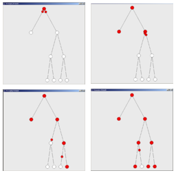
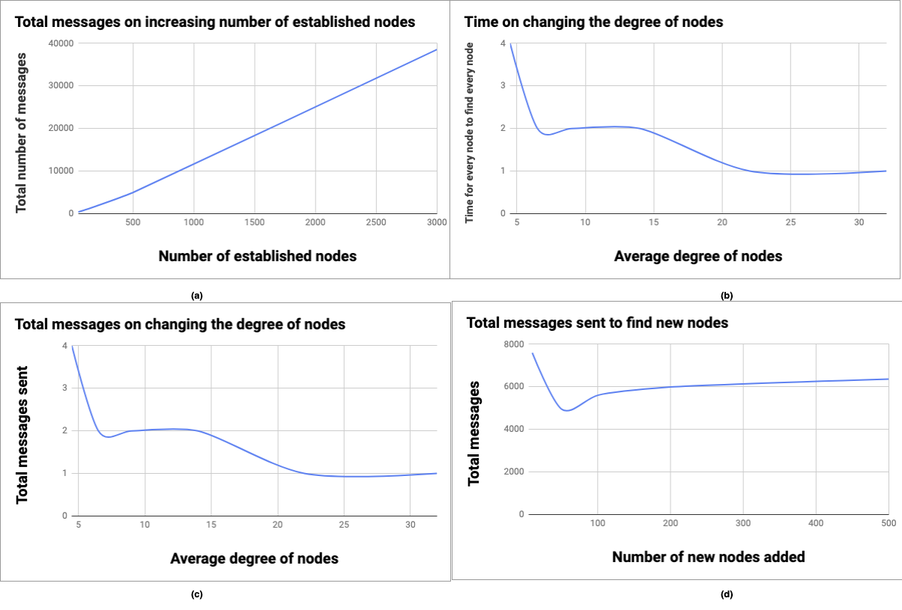
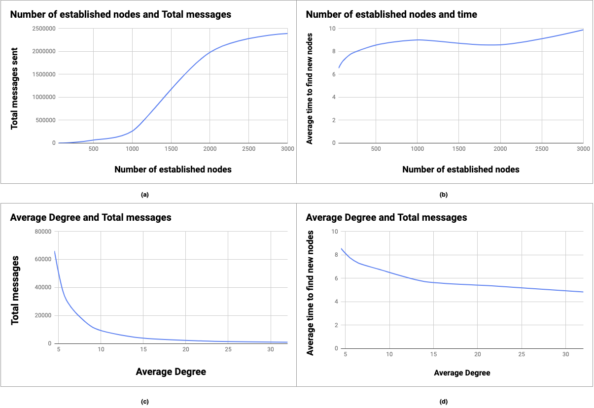
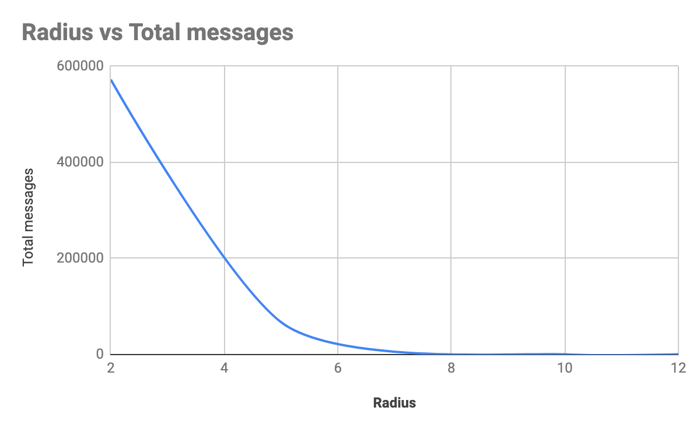

Modeling of methods for message routing in a network, with greater efficiency than naive gossip broadcast. The methods we implement and instrument are motivated not only by gossip protocols but also by standard Internet routing.

# Table Of Contents
1. [How To Run](#how-to-run)
2. [Peer Protocol](#peer-protocols)
3. [New Solution](#new-solution)
4. [Experiments](#experiments)

# How To Run
## Requirements

Install requirements by running `pip install requirements.txt`

## Flooding total messages

Run `python flooding.py <n> <N> <ds> <de>`, where

`n` - New nodes

`N` - Established nodes

`ds` - Degree range start

`de` - Degree range end

Example usage:

```
python flooding.py 5 50 3 4

#n  = 5     -  5 new nodes to be added
#N  = 50   -  50 established nodes
#ds = 3     - degree range start
#de = 4     - degree range end

```


## Peer-to-peer exchange total messages
Run `python dht.py <n> <N> <ds> <de>`, where 

`n` - New nodes

`N` - Established nodes

`ds` - Degree range start

`de` - Degree range end

Example usage:

```
python dht.py 5 50 3 4

#n  = 5     -  5 new nodes to be added
#N  = 50    -  50 established nodes
#ds = 3     - degree range start
#de = 4     - degree range end

```

# Peer Protocols
Many gossip networks  [6, 7, 8] use flooding to pass messages among the nodes. These networks are secure but encounter high bandwidth requirements.

## DHT
A Distributed Hash Table [4] is a decentralized hash table which stores key-value pairs. Each peer in the network stores a table with information about other peers and some metadata in the form of key-value pairs. DHTs are highly decentralized, fault tolerant and scalable. Kademlia [9], a DHT, is used in various p2p settings.
## Peer Discovery
Peers in a p2p network can be discovered in many ways. New peers joining the network can bootstrap if the peer knows at least one peer in the network. The network may also provide DNS addresses that new peers can use to learn about peers in the network.

Networks can have rendezvous points, routers that can bootstrap newer peers, to make it easier to find closer peers with better metrics such as latency, bandwidth and throughput. Closer peers can also be discovered with DHT walks. A peer can send messages to known peers and further message peers in their tables to find closer peers.
## Floodsub

Nearby peers are discovered with DHT walks or rendezvous points. After peer discovery, each peer forwards incoming messages to all known peers. The peer maintains a timed cache of previous messages, so that seen messages are not further forwarded. It also never forwards a message back to the source or the peer that forwarded the message. The flooding process is illustrated on Figure 1.


<p align="left"> Figure 1: Flooding </p>

Flooding has advantages and disadvantages. It is easy to implement, minimizes latency, and is highly robust. But, the outbound degree of the network is unbounded, which results in high bandwidth consumption and impacts scalability. If a node is densely connected, it might not have enough bandwidth to forward messages to all its peers.

## Randomsub
Randomsub is a more scalable variant of floodsub. Instead of forwarding messages to all known peers, randomsub forwards messages to a random subset of up to D peers, where D is the desired degree of the network. While this routing mechanism is scalable, the randomness introduces non-deterministic behavior in the message propagation factors which is undesirable for many applications.
## Meshsub
Meshsub forms an overlay mesh of its view of the network with bidirectional links. Initially, the overlay is constructed in a random fashion by selecting D peers at random and adding them to the mesh, where D is the desired degree of the network.

The mesh is maintained with the following periodic stabilization algorithm:
```
at each peer:
  loop:
    if |peers| < D_low:
       select D - |peers| non-mesh peers at random and add them to the mesh
    if |peers| > D_high:
       select |peers| - D mesh peers at random and remove them from the mesh
    sleep t
```
Where D is the target degree, D_low and D_high represent admissible mesh degree bounds.
## Gossipsub
Gossipsub [10] augments meshsub with gossip about message flow in the network. The gossip is emitted to random subsets of peers not in the mesh, similar to randomsub. These messages are metadata about the message flow e.g. since peers cache messages, message ids of seen messages in the last few seconds can be gossiped in the network so that peers can request them for transmission. Gossipsub provides a bounded degree and amplification factor with the meshsub and augments it using randomsub messages. Ethereum 2.0 (Serenity) [11] will use gossipsub as its wire protocol.
## Erlay
Erlay [12] is an efficient transaction relay protocol solution for Bitcoin. The current Bitcoin implementation announces every transaction to every peer and this results in a per-node bandwidth of 50GB/month. This is very inefficient and the authors found that 88% of the bandwidth usage is redundant. Similar to gossipsub, Erlay announcements are sent to a small number of connections. Further relay is achieved by periodically running a set of reconciliation protocol over every sets of withheld announcements bidirectionally. Erlay saves half of the bandwidth a node consumes and also saves 75% of overall bandwidth compared to the current protocol.

# New solution
Routing tables in routers store routes and metrics (latency, throughput, bandwidth etc.) for known peers. A typical routing looks like one in Fig. 2 [3]. Looking at the row, we see that this computer can reach the node 192.168.0.1, which is the router and also the next hop, through the network card 192.168.0.100. Metric indicates the cost associated with using the indicated route. Metrics can be used to determine optimal path to the destination.


<p align="center">Figure 2: Routing table on a computer with router 192.168.0.1</p>


We consider hop-by-hop routing (as in Fig. 2), which lists for all known peers, the address of the next peer (hop) along the path to the destination. Fig. 3 illustrates what hop-by-hop routing table looks like in the modeled peer-to-peer network. The routing table will have columns src, next hop, dest, and latency. Src is the source node, dest is the destination node, next hop refers to the next hop to be taken by the src node in order to reach the destination, and latency refers to the latency of the hop. 


<p align="center">Figure 3: Our wire protocol</p>


Consider that each peer maintains a routing table like in Figure 3. Every new peer will start with a peer discovery process, where it learns about existing peers from a fixed IP address and port in the network. When a peer learns about other peers in the network, it can add it to its table. Connected peers can exchange tables from time to time and add to their own table or replace and entry with a more optimal route.

When a peer wants to send messages to another peer, it looks for the peer’s path in its table. If it does not find it, it asks its neighbors. If none of the peers know about the destination, it sends messages to all known peers asking about the destination peer. Such messages are flooded through the network until the destination address is found. If the peer finds the table entry for the destination, it selects the best route by comparing latencies in its table and goes for least latency.

The best route selected by peer 1 to send a message to 6 is shown with dashed lines. Peer 1 finds that if it sends a message to 6 via 3, it will result in a latency of 12 and via 4 would result in a latency of 5, so it sends the message through 4 and takes path 1 -> 2 -> 4 -> 6


# Experiments
We explore two techniques in peer discovery to analyze the number of messages passed and time spent in communicating with newly added nodes in an established DHT peer-to-peer network.

Consider an established network of ‘N’ nodes with average degree ‘d’, and ‘n’ new nodes now being added, each of the new nodes known to exactly one of the pre-existing nodes. How long does it take for knowledge of the new nodes to spread and for messages to be routed? How many messages must be transmitted?
## Peer to peer exchange
In this technique, each node in the network looks at their neighbors’ hash table to see if there is any new or more optimal routes in the network and updates itself. One iteration ‘t’ of peer to peer exchange involves every node exchanging tables with its neighbors once. We assume that in this network everyone knows everyone (before the addition of new nodes). When ‘n’ new nodes are added, the new nodes only know one random neighbor in the established network. We find out how many iterations of peer to peer exchange is needed for all ‘N’ nodes to find out about the new ‘n’ nodes. We also find out how many total messages are passed in the network.

In Fig. 4 (a) we find that number of messages sent increases linearly when we increase the total number of established nodes. For 3000 nodes the total number of messages sent end up to an average of 38561. We fixed ‘n’ and ‘d’ to 10 and 4.5 respectively. We also find that ‘t’ to be 4 for all the established node sizes. In Fig. 4(b) we find that number of iterations ‘t’ decreases as average degree of nodes ‘d’ increases until a point (‘d’ = 22 here) after which we only need one iteration for every node to find every node. This means that high degree of connectivity in a network is highly desirable. But at the same time we see in 4(c) that the total messages sent still increases slightly as network reaches higher degree of connectivity. We fixed ‘N’ and ‘n’ as 500 and 10 respectively for this experiment. In Fig. 4(d), shows the impact of increasing number of new nodes ‘n’ in the network. We find that the messages sent is pretty much the same when ‘n’ is increased. Also, ‘t’ remains a constant 4 in this experiment. We fixed ‘N’ and ‘d’ to 500 and 4.5 respectively.



<p align="center">Figure 4: Peer-to-peer exchange </p>


## Flooding
In this technique, a node trying to send a message to a given destination that it does not already have in its table will simply forward the message to all its neighbors. The neighbors follow the same procedure. In this way, the message is flooded until it reaches a node that does have the destination in its table and can route the message in a more targeted way. We find out the average distance from each node to the new ‘n’ nodes and how many total number of messages are passed in the network for everyone to find everyone else after ‘n’ new nodes are added. We also define ‘r’, the radius, as the depth to which each node can pre-discover its neighbors. For example if ‘r’ is 2, each node would know its neighbor and its neighbor’s neighbors.

In Fig. 5(a) we see that as the number of established nodes increases as the total messages increases as expected. Also, in 5(b) we see that the average time for each node to reach the new ‘n’ nodes increases slightly as the number of established nodes increases. We fixed ‘n’, ‘r’, and ‘d’ as 10, 5 and 4.5 respectively. 5(c) and 5(d) shows the impact of increasing the average degree of nodes. It drastically decreases the total number of messages as now that the network is well-connected, it can find the new nodes at a lower depth. We also find the average time to reach the ‘n’ nodes to be slightly lower as a result of finding the nodes at a lower depth. We fixed ‘n’, ‘r’, and ‘N’ as 10, 5 and 500 respectively.



<p align="center">Fig. 5: Established nodes, Degree vs Total messages</p>

In Fig. 6 we find that increasing ‘r’ decreases the total messages sent drastically. One factor that influences this is that a lot of messages are sent during the pre-discovery stage where we find nodes till depth ‘r’ during the setup of the established network. As we set ‘r’ to 12, we find that the total messages passed is 500, which means that in an ideal situation where everyone knows everyone, each node only has to send N messages to find new nodes. We fixed ‘n’, ‘d’ and ‘N’ as 10, 4.5 and 500 respectively.



<p align="center">Figure 6: Radius vs Total messages</p>


## Conclusion
From Fig. 7, we see that peer-to-peer exchange reduces the total number of messages sent drastically compared to flooding. We fixed ‘N’, ‘n’, ‘d’, and ‘r’ to 500, 10, 4.5 and 5 respectively. 


<p align="center">Figure 7: Peer to peer vs flooding total messages</p>

# References
[1] https://en.wikipedia.org/wiki/Flooding_(computer_networking)

[2] https://github.com/libp2p/specs/tree/master/pubsub/gossipsub

[3] https://en.wikipedia.org/wiki/Routing_table

[4] https://en.wikipedia.org/wiki/Distributed_hash_table

[5] http://www.bittorrent.org/

[6] https://bitcoin.org/

[7] https://www.ethereum.org/

[8] https://en.wikipedia.org/wiki/Gossip_protocol

[9] Maymounkov, Petar and Mazieres, David. Kademlia: A Peer-to-Peer Information System Based on the XOR Metric. IPTPS '01. 2002

[10] https://github.com/libp2p/specs/tree/master/pubsub/gossipsub

[11] https://github.com/ethereum/eth2.0-specs

[12] https://lists.linuxfoundation.org/pipermail/bitcoin-dev/2019-May/016994.html
